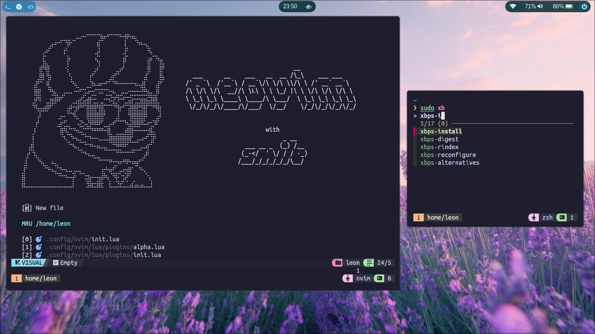

# 🤡 Moody Dotfiles
[](https://github.com/ledleledle/dotfiles/stargazers)
[](https://github.com/ledleledle/dotfiles)
[](https://github.com/ledleledle/dotfiles)

<picture>
  <source media="(prefers-color-scheme: dark)" alt="" align="right" width="400px" srcset="development_preview.png"/>
  
</picture>

:hand: **Hi there... Thank you for comming by!**

This is my personal configuration for Void Linux Environment (curently under Development).

Here are some details about my current setup:

- 💻 **Device** Lenovo Thinkpad X280
- 🪟 **Window Manager** [Hyprland](https://hyprland.org) tilling WM with rich features.
- 🌻 **Panel** [Waybar](https://github.com/Alexays/Waybar)
- 🚀 **Application Launcher** [Wofi](https://hg.sr.ht/~scoopta/wofi)
- 🔔 **Desktop Notification** [SwayNotificationCenter](https://github.com/ErikReider/SwayNotificationCenter)
- 🐱 **Terminal Emulator** [Kitty](https://github.com/kovidgoyal/kitty)
- 🖥️ **Shell** [Zsh](https://zsh.org) with tmux.
- 📚 **File Manager** [Thunar](https://wiki.archlinux.org/title/Thunar)
- 🎵 **Media Player** [mpv](https://mpv.io)
- 📖 **IDE** [Neovim](https://neovim.io/) using [NVChad](https://github.com/NvChad/NvChad).
- 🌐 **Browser** [Firefox](https://www.mozilla.org) with a cool theme.

## 🧑‍🔧 About the Dotfiles
> [!NOTE]
>  **TL;DR Who cares!?**

I started this project on 8 December 2024 when I got laid off from my previous company. This project helped me fill the gap after getting laid off and continues my journey in **Ricing** Industry, which has been left untouched since 2020. Looking at my previous dotfiles makes me think, **God... What is this mess?** They're so disorganized and nearly impossible to reproduce. So, my comeback here is to create dotfiles with clean and simple code also easy to use.

This configuration is inspired by this cruel world, depression and anxious feeling. Please note that these configuration is simply **what works and looks good to me**, and they may not work for everyone, you have to adjust by yourself if some not work or *different taste* (lol) :laughing:. Feel free to use or adapt anything you find useful. Feel free to reach out if you have any questions or problem.

**This configuration is:**
- :cry: Moody, can be dark or light.
- :keyboard: Keyboard users might love it but mouse-friendly too.

## 📚 Dependencies
This guide will help you to install some essential dependencies in order to used this configuration and running the OS properly.

> [!WARNING]  
> 🤖 Still tested and running on Void Linux only.<br>
> But I planned to supporting and providing info for any other Linux Distribution, until then if you're not using Void Linux, please research all the dependecies all by yourself 🙏

Anyway... You know how to install dependencies in Void Linux?
```bash
sudo xbps-install abc1 abc2 abc3 ...
```
### Pre-Requisite
To install this dotfiles, you need some of the dependencies to pull the resources.
```
git curl wget unzip
```

<details>
<summary><b>Core dependencies (Void Linux)</b></summary>

#### Core dependencies (in order to work properly)
> **Notes**: If you're previously using `wpa_supplicant` or any other network manager, please disable service or it will be conflict between services. We will use `NetworkManager` service to connect to internet.
```
xorg base-devel brightnessctl dbus elogind polkit seatd NetworkManager network-manager-applet SwayNotificationCenter tlp wlogout gvfs gvfs-mtp zsh fzf Thunar
```

Enable all services
```
sudo ln -s
```
**Context**: [XOrg](https://wiki.archlinux.org/title/Xorg), [D-Bus](https://docs.voidlinux.org/config/session-management.html#d-bus), [elogind & polkit](https://docs.voidlinux.org/config/power-management.html#elogind), [seatd](https://docs.voidlinux.org/config/session-management.html#seatd), [base-devel](https://bbs.archlinux.org/viewtopic.php?pid=1720288#p1720288), [TLP](https://docs.voidlinux.org/config/power-management.html), [SwayNotificationCenter](https://github.com/ErikReider/SwayNotificationCenter), [wlogout](https://github.com/ArtsyMacaw/wlogout), [GVFS](https://wiki.archlinux.org/title/Media_Transfer_Protocol), [Zsh](https://zsh.org), [fzf](https://github.com/junegunn/fzf), [Thunar](https://wiki.archlinux.org/title/Thunar)


#### Hyprland
Hyprland is not available from Void Linux’s official repositories [due to a conflict of packaging philosophy](https://github.com/void-linux/void-packages/issues/37544). However, a [third party repository](https://github.com/Makrennel/hyprland-void) is available with binary packages built in CI by GitHub Actions.

You can add this repository by creating a file such as `/etc/xbps.d/hyprland-void.conf` with the following contents:
```bash
echo "repository=https://raw.githubusercontent.com/Makrennel/hyprland-void/repository-x86_64-glibc" > /etc/xbps.d/hyprland-void.conf

# Then update repo
xbps-install -S
```
Then you can install the packages as you would any other:
```
hyprland xdg-desktop-portal-hyprland hyprland-protocols hyprpaper hyprlock hypridle
```

#### Audio, Screen sharing & Media Player
**TL;DR** `pavucontrol` with `pipewire` framework and `mpv` for media player.<br>
More detailed information can be read at this [Void Linux Documentation: PipeWire](https://docs.voidlinux.org/config/media/pipewire.html)
```
pavucontrol pipewire pipewire-devel alsa-pipewire wireplumber mpv
```

```bash
sudo mkdir -p 
sudo ln -s /usr/share/alsa/alsa.conf.d/50-pipewire.conf /etc/alsa/conf.d
sudo ln -s /usr/share/alsa/alsa.conf.d/99-pipewire-default.conf /etc/alsa/conf.d
```

#### Image viewer and screenshoot
Screenshoting with `slurp` and `grim`. And image viewer using `swappy`.
```
grim slurp swappy jq
```

#### Bluetooth (Optional)
If your device have bluetooth installed, then you need these dependencies.
```
bluez libspa-bluetooth blueman
```
`blueman` is optional, if you want to use app to manage bluetooth then install it!

Source: https://docs.voidlinux.org/config/bluetooth.html

#### Display Manager (Optional)
If you want to use display manager same as mine, I used `sddm` with theme based on [this](https://www.opendesktop.org/p/1272122). But there is one issue if we want to used `ssdm`, `Hyprland` session needed to be run on `dbus session`, in order to make that happen ussualy I run on terminal using command `dbus-run-session Hyprland`. But... If you're using `sddm` by default it will uses default `Hyprland`, so applications that needed `dbus` in order to be run is failing. The solution is we can edit `sudo nvim /usr/share/wayland-sessions/hyprland.desktop` like this:
```
[Desktop Entry]
Name=Hyprland
Comment=An intelligent dynamic tiling Wayland compositor
Exec=dbus-run-session Hyprland
Type=Application
```
And then, Install the requirements:
```bash
sddm qt5 qt5-quickcontrols2 qt5-svg qt5-graphicaleffects
```
Then download the theme and extract it to `/usr/share/sddm/themes`.
```bash
sudo tar -xf ~/Downloads/sugar-dark.tar -C /usr/share/sddm/themes
```
Edit `sddm` config at `/etc/sddm.conf.d/sddm.conf`, and find `[Theme]` section.
```
...
[Theme]
# Current theme name
Current=sugar-dark
...
```
</details>

<details>
<summary><b>Neovim</b></summary>

Required to install for neovim. `fd` and `ripgrep` will be used for `telescope` plugin.
```
neovim fd ripgrep
```
---

I'm using [NVChad](https://github.com/NvChad/NvChad). For more customizations please refer to [this documentation](https://nvchad.com/docs/config/walkthrough).

#### Syntax Highlighting & Code Snippet
```
# Syntax Highlighting
:TSInstall <your_programming_language>

# Code Snippet
:MasonInstall <your_programming_language>
```

</details>

<details>
<summary><b>Font</b></summary>
  
> Will be organized what used what not. Because font alone is eating up 8G of my storage! But Its still under development. So... I will be experimenting some font that match my taste!

Currently installed is:
```bash
twemoji xorg-fonts noto-fonts-ttf noto-fonts-cjk nerd-fonts noto-fonts-emoji
```
Using reference from [Void Linux Documentation](https://docs.voidlinux.org/config/graphical-session/fonts.html).

</details>

<details>
<summary><b>Cursor</b></summary>
  
I'm personaly used cursor from [catppuccin](https://github.com/catppuccin/cursors) called **Catppuccin Latte Light**. If you want to add more cursor, you can copy or extract to `~/.icons` or `~/.local/share/icons`. Then select desired cursor using `nwg-look`.

</details>

## 👾 Installation
Comming soon

## 🤝 Credits
They are my inspiration. *Pahlawan tanpa tanda jasa*.
- https://github.com/quantumfate/wofi
- The GOAT itself [@owl4ce](https://github.com/owl4ce/dotfiles)
<!--
## And thanks to
[](https://github.com/ledleledle/dotfiles)
-->
